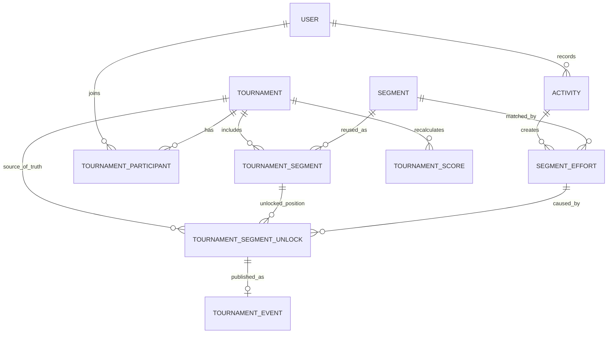
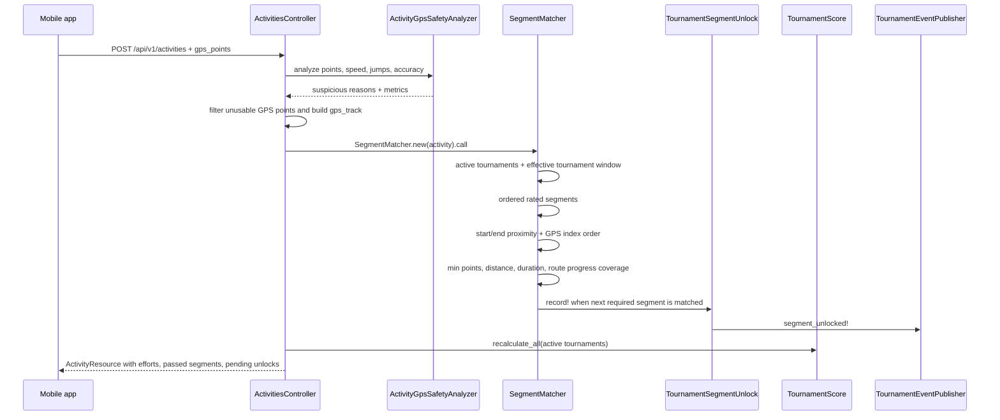

# Segment Tracking

> Українською: [segment-tracking.uk.md](segment-tracking.uk.md)

This document describes how SplitRace turns a recorded GPS activity into
segment efforts, tournament unlocks, scoring, feed events, and notifications.
It also documents the safety checks and edge cases currently covered by the
implementation.

## Goals

Segment tracking is built around four rules:

1. A global segment effort is not enough to unlock a tournament segment.
   Tournament progress is recorded separately in `TournamentSegmentUnlock`.
2. Only activity inside the tournament window counts. The effective start is
   `max(tournament.starts_at, participant.joined_at)` and the end is
   `tournament.ends_at` when present.
3. A runner must follow the route, not merely touch the start and finish.
   Route coverage, monotonic progress, minimum GPS density, minimum matched
   distance, and minimum matched duration are required.
4. Suspicious GPS is surfaced for review and severe GPS signals are rejected
   from segment matching. The app marks suspicious activity; it does not ban
   users automatically.

## Data Model



Key records:

| Record | Meaning | Code |
|--------|---------|------|
| `Activity` | Uploaded run with `gps_points`, `gps_track`, time, distance, and suspicious GPS metadata. | [app/models/activity.rb](../app/models/activity.rb) |
| `Segment` | Reusable route with `start_point`, `end_point`, `polyline`, and `distance_meters`. | [app/models/segment.rb](../app/models/segment.rb) |
| `SegmentEffort` | A user completed a segment in one activity. This is global to the segment, but tournament-aware queries filter by tournament window. | [app/models/segment_effort.rb](../app/models/segment_effort.rb) |
| `TournamentSegmentUnlock` | Source of truth for "this user unlocked this ordered tournament segment in this tournament." | [app/models/tournament_segment_unlock.rb](../app/models/tournament_segment_unlock.rb) |
| `TournamentEvent` | Feed event emitted from a tournament unlock. | [app/models/tournament_event.rb](../app/models/tournament_event.rb) |
| `TournamentScore` | Score and rank aggregate recomputed from tournament unlocks and eligible efforts. | [app/models/tournament_score.rb](../app/models/tournament_score.rb) |

## End-to-End Flow



The hot path starts in
[ActivitiesController#create](../app/controllers/api/v1/activities_controller.rb).
It parses `gps_points`, runs GPS safety analysis, builds `gps_track`, saves the
activity, runs [SegmentMatcher](../app/services/segment_matcher.rb), and then
recalculates scores for active tournaments.

## Matching Algorithm

### 1. Segment creation constraints

Segments must have at least two valid route points. Their route distance is
calculated server-side from the submitted points and must be at least `400m`.

This is enforced in:

- API segment creation:
  [app/controllers/api/v1/segments_controller.rb](../app/controllers/api/v1/segments_controller.rb)
- Admin segment form:
  [app/controllers/admin/segments_controller.rb](../app/controllers/admin/segments_controller.rb)
  and [app/views/admin/segments/_form.html.slim](../app/views/admin/segments/_form.html.slim)
- Model validation:
  [Segment::MIN_DISTANCE_METERS](../app/models/segment.rb)
- Mobile creator UX:
  [mobile/src/screens/NewSegmentScreen.jsx](../mobile/src/screens/NewSegmentScreen.jsx)

Why: very short segments are too easy to trigger with noisy or sparse GPS and
are especially fragile when start and finish are close.

### 2. GPS safety analysis before matching

`ActivityGpsSafetyAnalyzer` evaluates every uploaded activity before segment
matching:

- minimum GPS point count;
- bad accuracy ratio;
- unrealistic average speed;
- unrealistic point-to-point speed;
- teleport jumps between consecutive GPS samples;
- non-monotonic timestamps as a metric.

The result is stored on `Activity` in `suspicious`, `suspicious_reasons`, and
`gps_quality`. Severe reason codes make `Activity#gps_match_rejected?` return
`true`, and `SegmentMatcher#call` exits before creating efforts.

Current severe rejection codes:

- `teleport_jump`
- `too_many_low_accuracy_points`
- `unrealistic_average_speed`
- `unrealistic_point_speed`

The activity is still saved. Admins can review suspicious activity instead of
the system applying an automatic ban.

### 3. Tournament window filtering

Old runs must not unlock a new tournament. The effective segment window is:

```ruby
window_start = [tournament.starts_at, participant.joined_at].compact.max
window_end = tournament.ends_at
```

Implemented in:

- `SegmentEffort.tournament_window_start`
- `SegmentEffort.started_in_tournament_window?`
- `SegmentEffort.in_tournament_window`
- `SegmentMatcher#activity_overlaps_tournament_window?`
- `TournamentSegmentUnlock#unlocked_inside_tournament_window`

This means:

- an effort before `tournament.starts_at` does not count;
- an effort before the runner joined does not count;
- if the runner joined before the tournament start, counting begins at
  `tournament.starts_at`;
- efforts at or after `tournament.ends_at` do not count.

### 4. Candidate start/end proximity

For each active tournament the runner participates in, `SegmentMatcher` checks
rated segments in `order_number` order.

The first cheap spatial filter uses PostGIS `ST_DWithin` against the activity
`gps_track`:

- short segments, below `800m`: `20m` start/end proximity;
- longer segments: `30m` start/end proximity.

Then the matcher finds the closest usable GPS point to `start_point` and
`end_point`. The start index must be before the end index.

Point-level tolerance also considers GPS accuracy:

```ruby
effective_tolerance = min(base_tolerance, max(accuracy + 5m, 10m))
```

So high-accuracy points cannot match a far parallel street just because the
global corridor would allow it.

### 5. Required movement inside the segment

The GPS slice between the matched start and finish must satisfy all of these:

- at least `4` GPS points inside the segment;
- traveled distance inside the segment >= `75%` of segment distance;
- duration inside the segment >= `30s`;
- route coverage >= `75%`.

This protects circular or near-circular segments where start and finish are
close. Standing near both points is not enough.

### 6. Route coverage by progress along polyline

For every route polyline, `SegmentMatcher` builds a linear measure:

```text
route point -> projected segment -> distance along route, in meters
```

Each activity point is projected onto nearby route segments. The matcher then
keeps only matches that move forward along the route, allowing a small
`20m` backtrack tolerance for GPS jitter.

It also rejects impossible progress jumps:

```text
progress_delta <= actual_gps_move + (corridor_tolerance * 2) + 20m
```

Finally, the route is split into `20m` bins, and at least `75%` of bins must be
covered by projected matches.

This protects:

- cuts from start to finish around a block;
- self-intersections and loops where a runner can touch the crossing but skip
  part of the route;
- sparse two-point tracks that only hit start and finish;
- close start/finish loops.

### 7. Ordered tournament unlocks

`SegmentEffort` answers "did this activity complete this segment?"
`TournamentSegmentUnlock` answers "did this user unlock this tournament segment
at this ordered position in this tournament?"

The matcher uses unlocks as the source of truth:

1. Load already unlocked rated segments for the user and tournament.
2. Walk rated `TournamentSegment` records by `order_number`.
3. If a segment was previously unlocked, the user may re-run it to improve
   time, but it does not block order.
4. For the first missing segment, try to match it in the current activity.
5. If matched, create `TournamentSegmentUnlock`.
6. Stop at the first missing segment that was not matched.

This prevents a later segment from opening before earlier rated segments have
been unlocked.

### 8. Scoring, first opener, feed, notifications

Scoring uses tournament unlocks as the completion set:

- `completed_segments_count` is based on unlocks, not all historical efforts;
- best effort is chosen only from efforts in the tournament window and after
  the segment was unlocked;
- first opener bonus uses the first `TournamentSegmentUnlock` for that
  tournament and segment;
- leaderboard resources use the same unlock-aware helpers.

Feed and notifications are also driven by unlocks:

- `TournamentEventPublisher.segment_unlocked!` creates a `TournamentEvent`
  linked to `tournament_segment_unlock`;
- all other tournament participants receive localized `Notification` rows and
  Expo push delivery attempts;
- the actor does not receive their own notification.

## Covered Edge Cases

| Case | Risk | Current behavior |
|------|------|------------------|
| Old runs before tournament start | Historical `SegmentEffort` could unlock a new tournament. | Window checks require effort start >= max tournament start and join time. |
| User joins after tournament start | Runs before joining could count. | Effective window starts at `participant.joined_at`. |
| User joins before tournament start | Runs before tournament launch could count. | Effective window starts at `tournament.starts_at`. |
| Tournament has an end date | Late runs could count. | Efforts at or after `tournament.ends_at` are excluded. |
| Rated segment order | A later rated segment could unlock first. | Unlocks are walked by `TournamentSegment.order_number`; first missing segment blocks later ones. |
| First opener bonus | Historical efforts could win first opener. | Bonus uses first `TournamentSegmentUnlock` in the tournament. |
| GPS spoofing | Fake routes, jumps, or car-like speeds could produce efforts. | Suspicious activity is flagged; severe GPS reasons reject segment matching. |
| Sparse GPS | Two GPS points could hit start and finish. | Minimum 4 points, distance, duration, and coverage are required. |
| Short segments | 100-300m segments are unstable with city GPS. | Segment creation rejects routes below 400m. |
| Parallel city paths | 30m corridor can include a neighboring path. | Short segments use 20m; per-point accuracy can narrow tolerance. |
| Loops/self-intersections | Matching nearest points can accept route cuts. | Progress along polyline must be monotonic and sufficiently covered. |
| Close start/finish loops | Standing near start/finish could look like completion. | Matched movement, duration, and route coverage are mandatory. |

## Current Thresholds

| Threshold | Value | Where |
|-----------|-------|-------|
| Minimum segment creation distance | `400m` | `Segment::MIN_DISTANCE_METERS` |
| Short segment cutoff | `< 800m` | `SegmentMatcher::SHORT_SEGMENT_DISTANCE_METERS` |
| Short segment start/end tolerance | `20m` | `SegmentMatcher::SHORT_SEGMENT_PROXIMITY_METERS` |
| Long segment start/end tolerance | `30m` | `SegmentMatcher::LONG_SEGMENT_PROXIMITY_METERS` |
| Short route corridor | `20m` | `SegmentMatcher::SHORT_SEGMENT_ROUTE_CORRIDOR_METERS` |
| Long route corridor | `30m` | `SegmentMatcher::LONG_SEGMENT_ROUTE_CORRIDOR_METERS` |
| Minimum point tolerance after accuracy narrowing | `10m` | `SegmentMatcher::MIN_GPS_TOLERANCE_METERS` |
| GPS accuracy padding | `5m` | `SegmentMatcher::GPS_ACCURACY_PADDING_METERS` |
| Route progress bin size | `20m` | `SegmentMatcher::ROUTE_SAMPLE_METERS` |
| Required route coverage | `75%` | `SegmentMatcher::MIN_ROUTE_COVERAGE` |
| Minimum GPS points inside segment | `4` | `SegmentMatcher::MIN_SEGMENT_GPS_POINTS` |
| Minimum matched distance | `75%` of segment distance | `SegmentMatcher::MIN_SEGMENT_ACTIVITY_DISTANCE_RATIO` |
| Minimum matched duration | `30s` | `SegmentMatcher::MIN_SEGMENT_ACTIVITY_DURATION_SECONDS` |
| GPS safety minimum points | `4` | `ActivityGpsSafetyAnalyzer::MIN_GPS_POINTS` |
| Poor GPS accuracy | `> 50m` | `Activity::GPS_MATCHING_ACCURACY_METERS` |
| Max poor accuracy ratio | `40%` | `ActivityGpsSafetyAnalyzer::MAX_POOR_ACCURACY_RATIO` |
| Max average speed | `8.5 m/s` | `ActivityGpsSafetyAnalyzer::MAX_AVERAGE_SPEED_MPS` |
| Max point speed | `12 m/s` | `ActivityGpsSafetyAnalyzer::MAX_POINT_SPEED_MPS` |
| Teleport jump | `> 300m within 10s` | `ActivityGpsSafetyAnalyzer` |

## Code Map

| Area | Files |
|------|-------|
| Activity upload, GPS parsing, track construction | [app/controllers/api/v1/activities_controller.rb](../app/controllers/api/v1/activities_controller.rb) |
| Segment matching core | [app/services/segment_matcher.rb](../app/services/segment_matcher.rb) |
| GPS safety and suspicious activity | [app/services/activity_gps_safety_analyzer.rb](../app/services/activity_gps_safety_analyzer.rb), [app/models/activity.rb](../app/models/activity.rb) |
| Segment creation validation | [app/models/segment.rb](../app/models/segment.rb), [app/controllers/api/v1/segments_controller.rb](../app/controllers/api/v1/segments_controller.rb), [app/controllers/admin/segments_controller.rb](../app/controllers/admin/segments_controller.rb) |
| Mobile segment creation warning | [mobile/src/screens/NewSegmentScreen.jsx](../mobile/src/screens/NewSegmentScreen.jsx) |
| Mobile high-accuracy run tracking | [mobile/src/screens/RunTrackerScreen.jsx](../mobile/src/screens/RunTrackerScreen.jsx) |
| Tournament unlock source of truth | [app/models/tournament_segment_unlock.rb](../app/models/tournament_segment_unlock.rb) |
| Score calculation and first opener bonus | [app/models/tournament_score.rb](../app/models/tournament_score.rb) |
| Leaderboard serialization | [app/resources/score_resource.rb](../app/resources/score_resource.rb) |
| Activity response, pending unlocks, passed segments | [app/resources/activity_resource.rb](../app/resources/activity_resource.rb) |
| Feed and notifications | [app/services/tournament_event_publisher.rb](../app/services/tournament_event_publisher.rb) |

## Test Map

| Behavior | Tests |
|----------|-------|
| Route following, cuts, self-intersections, sparse GPS, close loops | [test/integration/segment_route_matching_test.rb](../test/integration/segment_route_matching_test.rb) |
| Tournament windows, ordered unlocks, activity lifecycle | [test/integration/api_lifecycle_test.rb](../test/integration/api_lifecycle_test.rb) |
| First opener bonus from unlocks | [test/models/tournament_score_test.rb](../test/models/tournament_score_test.rb) |
| GPS safety analyzer | [test/services/activity_gps_safety_analyzer_test.rb](../test/services/activity_gps_safety_analyzer_test.rb) |
| Segment creation minimum distance | [test/integration/api_creator_flows_test.rb](../test/integration/api_creator_flows_test.rb), [test/integration/admin_segments_test.rb](../test/integration/admin_segments_test.rb) |
| Notifications after unlock | [test/integration/api_notifications_test.rb](../test/integration/api_notifications_test.rb) |
| Leaderboard first opener display | [test/integration/api_leaderboard_test.rb](../test/integration/api_leaderboard_test.rb) |
| Mobile run tracking GPS behavior | [mobile/src/__tests__/screens/RunTrackerScreen.test.jsx](../mobile/src/__tests__/screens/RunTrackerScreen.test.jsx) |

## Limitations and Future Improvements

- The matcher is still a lightweight in-app map matcher, not a full Hidden
  Markov Model or road-network matcher.
- Thresholds are global constants. Future work could tune them by segment type,
  GPS density, city/park context, or creator confidence.
- Suspicious GPS creates review signals and can reject matching, but there is
  no automatic ban workflow.
- Imported activities from third-party providers should be run through the same
  safety and matching pipeline.
- Admin tooling can grow from "suspicious badges and metrics" to a richer
  review queue with replay, maps, and reason-specific filters.
