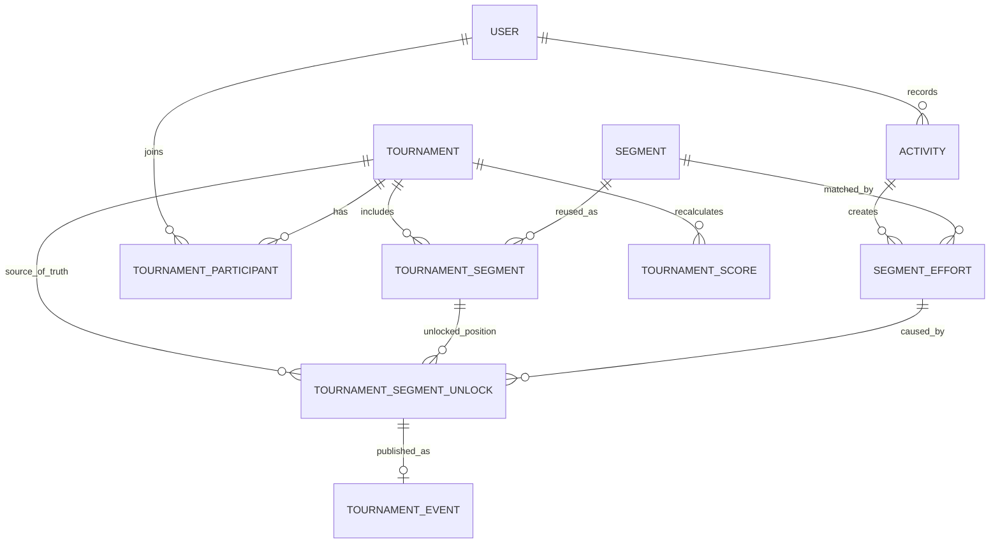
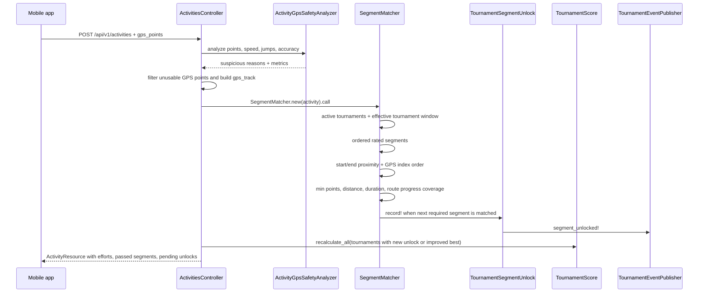

# Трекінг сегментів

> In English: [segment-tracking.md](segment-tracking.md)

Цей документ описує, як SplitRace перетворює записану GPS-активність на
segment efforts, tournament unlocks, скоринг, події стрічки і нотифікації. Тут
також зафіксовані safety-перевірки та edge cases, які зараз покриває система.

## Цілі

Трекінг сегментів побудований навколо чотирьох правил:

1. Глобальний `SegmentEffort` сам по собі не відкриває сегмент у турнірі.
   Турнірний прогрес записується окремо в `TournamentSegmentUnlock`.
2. Рахується тільки активність всередині турнірного вікна. Ефективний старт -
   `max(tournament.starts_at, participant.joined_at)`, а кінець -
   `tournament.ends_at`, якщо він заданий.
3. Бігун має пройти маршрут, а не просто торкнутись старту і фінішу. Потрібні
   route coverage, монотонний прогрес, мінімальна щільність GPS, мінімальна
   дистанція всередині сегмента і мінімальна тривалість.
4. Підозрілий GPS показується для рев'ю, а важкі GPS-сигнали відхиляються від
   матчингу сегментів. Система позначає активність як suspicious, але не банить
   користувача автоматично.
5. Повторне проходження вже відкритого рейтингового сегмента може покращити
   best tournament effort, але ніколи не створює другий unlock, feed event або
   notification для того самого турнірного сегмента.

## Модель даних



Ключові записи:

| Запис | Що означає | Код |
|-------|------------|-----|
| `Activity` | Завантажена пробіжка з `gps_points`, `gps_track`, часом, дистанцією і suspicious GPS metadata. | [app/models/activity.rb](../app/models/activity.rb) |
| `Segment` | Перевикористовуваний маршрут зі `start_point`, `end_point`, `polyline` і `distance_meters`. | [app/models/segment.rb](../app/models/segment.rb) |
| `SegmentEffort` | Користувач пройшов сегмент в одній активності. Це глобальний запис для сегмента, але турнірні запити фільтрують його по вікну турніру. | [app/models/segment_effort.rb](../app/models/segment_effort.rb) |
| `TournamentSegmentUnlock` | Джерело правди для "цей користувач відкрив цей ordered tournament segment у цьому турнірі". | [app/models/tournament_segment_unlock.rb](../app/models/tournament_segment_unlock.rb) |
| `TournamentEvent` | Подія стрічки, створена з турнірного unlock. | [app/models/tournament_event.rb](../app/models/tournament_event.rb) |
| `TournamentScore` | Агрегат балів і рангу, який перераховується з турнірних unlocks та eligible efforts. | [app/models/tournament_score.rb](../app/models/tournament_score.rb) |

## End-to-End Flow



Гарячий шлях починається в
[ActivitiesController#create](../app/controllers/api/v1/activities_controller.rb).
Контролер парсить `gps_points`, запускає GPS safety analysis, будує `gps_track`,
зберігає активність, запускає [SegmentMatcher](../app/services/segment_matcher.rb)
і потім перераховує скоринг тільки тих активних турнірів, де змінився unlock
state або best effort.

## Алгоритм матчингу

### 1. Обмеження при створенні сегмента

Сегмент має мати мінімум дві валідні route points. Дистанція маршруту рахується
на сервері з переданих точок і має бути не меншою за `400m`.

Це enforced у:

- API створення сегмента:
  [app/controllers/api/v1/segments_controller.rb](../app/controllers/api/v1/segments_controller.rb)
- адмінській формі:
  [app/controllers/admin/segments_controller.rb](../app/controllers/admin/segments_controller.rb)
  і [app/views/admin/segments/_form.html.slim](../app/views/admin/segments/_form.html.slim)
- model validation:
  [Segment::MIN_DISTANCE_METERS](../app/models/segment.rb)
- mobile creator UX:
  [mobile/src/screens/NewSegmentScreen.jsx](../mobile/src/screens/NewSegmentScreen.jsx)

Навіщо: дуже короткі сегменти занадто легко зачепити шумним або рідким GPS.
Особливо це болить, коли старт і фініш поруч.

### 2. GPS safety analysis перед матчингом

`ActivityGpsSafetyAnalyzer` перевіряє кожну завантажену активність до матчингу
сегментів:

- мінімальна кількість GPS-точок;
- частка точок із поганою точністю;
- нереалістична середня швидкість;
- нереалістична швидкість між сусідніми точками;
- teleport jumps між сусідніми GPS samples;
- non-monotonic timestamps як метрика.

Результат зберігається в `Activity` у полях `suspicious`,
`suspicious_reasons` і `gps_quality`. Важкі reason codes змушують
`Activity#gps_match_rejected?` повернути `true`, і `SegmentMatcher#call`
виходить до створення efforts.

Поточні severe rejection codes:

- `teleport_jump`
- `too_many_low_accuracy_points`
- `unrealistic_average_speed`
- `unrealistic_point_speed`

Активність все одно зберігається. Адмін може її переглянути, замість того щоб
система автоматично банила користувача.

### 3. Фільтр турнірного вікна

Старі пробіжки не мають відкривати новий турнір. Ефективне вікно сегмента:

```ruby
window_start = [tournament.starts_at, participant.joined_at].compact.max
window_end = tournament.ends_at
```

Реалізовано в:

- `SegmentEffort.tournament_window_start`
- `SegmentEffort.started_in_tournament_window?`
- `SegmentEffort.in_tournament_window`
- `SegmentMatcher#activity_overlaps_tournament_window?`
- `TournamentSegmentUnlock#unlocked_inside_tournament_window`

Це означає:

- effort до `tournament.starts_at` не рахується;
- effort до вступу користувача в турнір не рахується;
- якщо користувач вступив до старту турніру, рахунок починається з
  `tournament.starts_at`;
- efforts у момент або після `tournament.ends_at` не рахуються.

### 4. Candidate start/end proximity

Для кожного активного турніру, в якому бере участь runner, `SegmentMatcher`
перевіряє рейтингові сегменти за `order_number`.

Перший дешевий spatial filter використовує PostGIS `ST_DWithin` по activity
`gps_track`:

- короткі сегменти, менше `800m`: `20m` proximity для старту/фінішу;
- довші сегменти: `30m` proximity для старту/фінішу.

Після цього matcher знаходить найближчу usable GPS-точку до `start_point` і
`end_point`. Індекс старту має бути перед індексом фінішу.

Point-level tolerance також враховує GPS accuracy:

```ruby
effective_tolerance = min(base_tolerance, max(accuracy + 5m, 10m))
```

Тому high-accuracy point не може заматчитись на далеку паралельну доріжку лише
через те, що глобальний corridor це дозволив би.

### 5. Обов'язковий рух всередині сегмента

GPS slice між matched start і finish має пройти всі умови:

- мінімум `4` GPS-точки всередині сегмента;
- пройдена дистанція всередині сегмента >= `75%` дистанції сегмента;
- тривалість всередині сегмента >= `30s`;
- route coverage >= `75%`.

Це захищає кругові або майже кругові сегменти, де старт і фініш поруч. Просто
постояти біля обох точок - недостатньо.

### 6. Route coverage через progress along polyline

Для кожного route polyline `SegmentMatcher` будує лінійну міру:

```text
route point -> projected segment -> distance along route, in meters
```

Кожна activity point проектується на близькі сегменти маршруту. Matcher залишає
тільки matches, які рухаються вперед по маршруту, допускаючи невеликий `20m`
backtrack tolerance для GPS jitter.

Також відсікаються неможливі стрибки прогресу:

```text
progress_delta <= actual_gps_move + (corridor_tolerance * 2) + 20m
```

Потім маршрут ділиться на `20m` bins, і мінімум `75%` bins мають бути покриті
projected matches.

Це захищає від:

- зрізу від старту до фінішу навколо кварталу;
- self-intersections і петель, де runner може торкнутись crossing, але
  пропустити частину маршруту;
- sparse two-point tracks, які зачепили тільки старт і фініш;
- close start/finish loops.

### 7. Ordered tournament unlocks

`SegmentEffort` відповідає на питання: "ця активність пройшла цей сегмент?"
`TournamentSegmentUnlock` відповідає на питання: "цей користувач відкрив цей
турнірний сегмент на цій позиції в цьому турнірі?"

Matcher використовує unlocks як source of truth:

1. Завантажує вже відкриті rated segments для користувача і турніру.
2. Іде по rated `TournamentSegment` за `order_number`.
3. Якщо сегмент вже відкритий, користувач може перепробігти його для кращого
   часу, але це не блокує порядок. Повільніші repeat efforts зберігаються як
   історія активності, але не позначають турнірний скоринг як змінений.
4. Для першого відсутнього сегмента matcher пробує знайти match у поточній
   активності.
5. Якщо match є, створюється `TournamentSegmentUnlock`.
6. На першому missing segment без match ланцюжок зупиняється.

Так пізніший рейтинговий сегмент не може відкритись раніше за попередні.

### 8. Скоринг, first opener, feed, notifications

Скоринг використовує tournament unlocks як completion set:

- `completed_segments_count` базується на unlocks, а не на всіх історичних
  efforts;
- best effort вибирається тільки з efforts у tournament window і після того,
  як сегмент було unlocked;
- first opener bonus використовує перший `TournamentSegmentUnlock` для цього
  турніру і сегмента;
- повторні пробіжки після unlock можуть оновити best effort, якщо вони швидші,
  а повільніші повтори не запускають перерахунок score;
- leaderboard resources використовують ті самі unlock-aware helpers.

Feed і notifications теж прив'язані до unlocks:

- `TournamentEventPublisher.segment_unlocked!` створює `TournamentEvent`,
  linked to `tournament_segment_unlock`;
- якщо unlock вже має event, publisher повертає існуючий event і не створює
  duplicate feed item чи notification;
- всі інші учасники турніру отримують локалізовані `Notification` rows і Expo
  push delivery attempts;
- actor не отримує власну нотифікацію.

## Покриті Edge Cases

| Кейс | Ризик | Поточна поведінка |
|------|-------|-------------------|
| Старі пробіжки до старту турніру | Історичний `SegmentEffort` міг би відкрити новий турнір. | Window checks вимагають effort start >= max tournament start і join time. |
| Користувач вступив після старту турніру | Пробіжки до вступу могли б рахуватись. | Effective window стартує з `participant.joined_at`. |
| Користувач вступив до старту турніру | Пробіжки до launch могли б рахуватись. | Effective window стартує з `tournament.starts_at`. |
| У турніру є дата завершення | Пізні пробіжки могли б рахуватись. | Efforts у момент або після `tournament.ends_at` виключаються. |
| Порядок rated segments | Пізніший сегмент міг би відкритись першим. | Unlocks проходять за `TournamentSegment.order_number`; перший missing segment блокує наступні. |
| Повтор вже відкритого rated segment | Retry міг би створити duplicate unlock/feed або зайвий score recalculation. | Unlock залишається унікальним; швидші повтори можуть покращити best effort і перерахувати score, повільніші - ні. |
| First opener bonus | Історичні efforts могли б виграти first opener. | Бонус використовує перший `TournamentSegmentUnlock` у турнірі. |
| GPS spoofing | Fake routes, jumps або car-like speeds могли б створити efforts. | Suspicious activity позначається; severe GPS reasons reject segment matching. |
| Sparse GPS | Дві GPS-точки могли б зачепити start і finish. | Потрібні мінімум 4 точки, дистанція, duration і coverage. |
| Короткі сегменти | 100-300m сегменти нестабільні з міським GPS. | Створення сегмента відхиляє routes менші за 400m. |
| Паралельні міські доріжки | 30m corridor може зачепити сусідню доріжку. | Short segments використовують 20m; per-point accuracy може звузити tolerance. |
| Петлі/self-intersections | Найближчі точки можуть прийняти зріз маршруту. | Progress along polyline має бути монотонним і достатньо покритим. |
| Close start/finish loops | Стояння біля старту/фінішу могло б виглядати як completion. | Matched movement, duration і route coverage є обов'язковими. |

## Поточні Пороги

| Поріг | Значення | Де |
|-------|----------|----|
| Мінімальна дистанція створення сегмента | `400m` | `Segment::MIN_DISTANCE_METERS` |
| Межа короткого сегмента | `< 800m` | `SegmentMatcher::SHORT_SEGMENT_DISTANCE_METERS` |
| Start/end tolerance короткого сегмента | `20m` | `SegmentMatcher::SHORT_SEGMENT_PROXIMITY_METERS` |
| Start/end tolerance довгого сегмента | `30m` | `SegmentMatcher::LONG_SEGMENT_PROXIMITY_METERS` |
| Corridor короткого маршруту | `20m` | `SegmentMatcher::SHORT_SEGMENT_ROUTE_CORRIDOR_METERS` |
| Corridor довгого маршруту | `30m` | `SegmentMatcher::LONG_SEGMENT_ROUTE_CORRIDOR_METERS` |
| Мінімальний point tolerance після accuracy narrowing | `10m` | `SegmentMatcher::MIN_GPS_TOLERANCE_METERS` |
| GPS accuracy padding | `5m` | `SegmentMatcher::GPS_ACCURACY_PADDING_METERS` |
| Розмір route progress bin | `20m` | `SegmentMatcher::ROUTE_SAMPLE_METERS` |
| Обов'язковий route coverage | `75%` | `SegmentMatcher::MIN_ROUTE_COVERAGE` |
| Мінімум GPS-точок всередині сегмента | `4` | `SegmentMatcher::MIN_SEGMENT_GPS_POINTS` |
| Мінімальна matched distance | `75%` дистанції сегмента | `SegmentMatcher::MIN_SEGMENT_ACTIVITY_DISTANCE_RATIO` |
| Мінімальна matched duration | `30s` | `SegmentMatcher::MIN_SEGMENT_ACTIVITY_DURATION_SECONDS` |
| Мінімум GPS-точок для safety analysis | `4` | `ActivityGpsSafetyAnalyzer::MIN_GPS_POINTS` |
| Погана GPS accuracy | `> 50m` | `Activity::GPS_MATCHING_ACCURACY_METERS` |
| Максимальна частка поганої accuracy | `40%` | `ActivityGpsSafetyAnalyzer::MAX_POOR_ACCURACY_RATIO` |
| Максимальна середня швидкість | `8.5 m/s` | `ActivityGpsSafetyAnalyzer::MAX_AVERAGE_SPEED_MPS` |
| Максимальна швидкість між точками | `12 m/s` | `ActivityGpsSafetyAnalyzer::MAX_POINT_SPEED_MPS` |
| Teleport jump | `> 300m within 10s` | `ActivityGpsSafetyAnalyzer` |

## Code Map

| Зона | Файли |
|------|-------|
| Activity upload, GPS parsing, track construction | [app/controllers/api/v1/activities_controller.rb](../app/controllers/api/v1/activities_controller.rb) |
| Ядро segment matching | [app/services/segment_matcher.rb](../app/services/segment_matcher.rb) |
| GPS safety і suspicious activity | [app/services/activity_gps_safety_analyzer.rb](../app/services/activity_gps_safety_analyzer.rb), [app/models/activity.rb](../app/models/activity.rb) |
| Segment creation validation | [app/models/segment.rb](../app/models/segment.rb), [app/controllers/api/v1/segments_controller.rb](../app/controllers/api/v1/segments_controller.rb), [app/controllers/admin/segments_controller.rb](../app/controllers/admin/segments_controller.rb) |
| Mobile segment creation warning | [mobile/src/screens/NewSegmentScreen.jsx](../mobile/src/screens/NewSegmentScreen.jsx) |
| Mobile high-accuracy run tracking | [mobile/src/screens/RunTrackerScreen.jsx](../mobile/src/screens/RunTrackerScreen.jsx) |
| Tournament unlock source of truth | [app/models/tournament_segment_unlock.rb](../app/models/tournament_segment_unlock.rb) |
| Score calculation і first opener bonus | [app/models/tournament_score.rb](../app/models/tournament_score.rb) |
| Leaderboard serialization | [app/resources/score_resource.rb](../app/resources/score_resource.rb) |
| Activity response, pending unlocks, passed segments | [app/resources/activity_resource.rb](../app/resources/activity_resource.rb) |
| Feed і notifications | [app/services/tournament_event_publisher.rb](../app/services/tournament_event_publisher.rb) |

## Test Map

| Поведінка | Тести |
|-----------|-------|
| Route following, cuts, self-intersections, sparse GPS, close loops | [test/integration/segment_route_matching_test.rb](../test/integration/segment_route_matching_test.rb) |
| Tournament windows, ordered unlocks, activity lifecycle | [test/integration/api_lifecycle_test.rb](../test/integration/api_lifecycle_test.rb) |
| First opener bonus from unlocks | [test/models/tournament_score_test.rb](../test/models/tournament_score_test.rb) |
| GPS safety analyzer | [test/services/activity_gps_safety_analyzer_test.rb](../test/services/activity_gps_safety_analyzer_test.rb) |
| Segment creation minimum distance | [test/integration/api_creator_flows_test.rb](../test/integration/api_creator_flows_test.rb), [test/integration/admin_segments_test.rb](../test/integration/admin_segments_test.rb) |
| Notifications after unlock | [test/integration/api_notifications_test.rb](../test/integration/api_notifications_test.rb) |
| Leaderboard first opener display | [test/integration/api_leaderboard_test.rb](../test/integration/api_leaderboard_test.rb) |
| Mobile run tracking GPS behavior | [mobile/src/__tests__/screens/RunTrackerScreen.test.jsx](../mobile/src/__tests__/screens/RunTrackerScreen.test.jsx) |

## Обмеження і майбутні покращення

- Matcher все ще lightweight in-app map matcher, а не повний Hidden Markov
  Model чи road-network matcher.
- Пороги зараз глобальні constants. Далі їх можна налаштовувати по типу
  сегмента, GPS density, city/park context або creator confidence.
- Suspicious GPS створює сигнали для review і може reject matching, але
  automatic ban workflow немає.
- Imported activities від third-party providers мають проходити той самий
  safety і matching pipeline.
- Адмінку можна розвинути від suspicious badges and metrics до повноцінної
  review queue з replay, maps і reason-specific filters.
